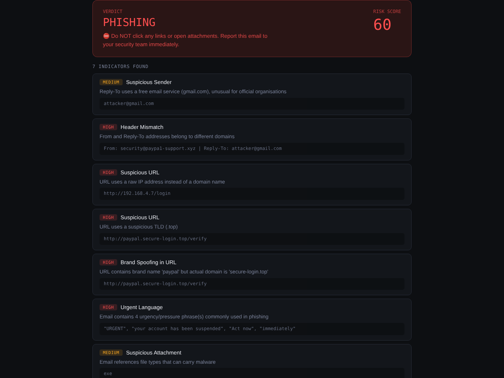
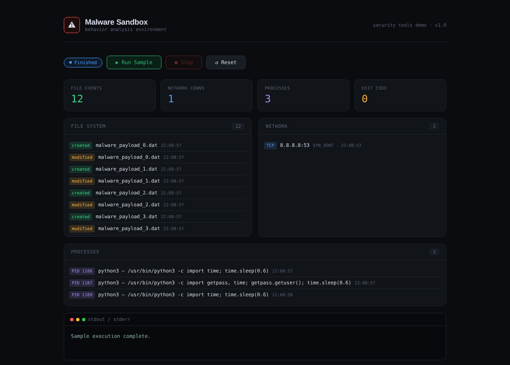
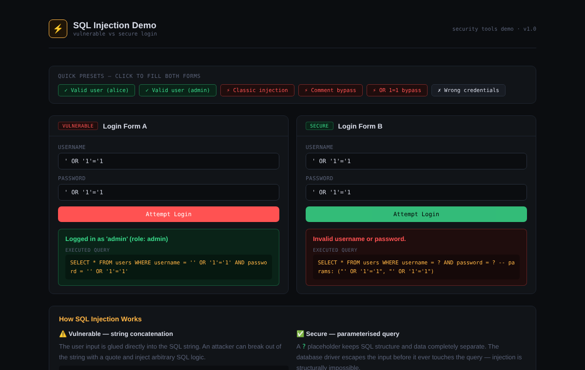

# Security Tools in Python

Three small security tools built with Python and Flask.





## Tools

| # | Tool | Port | What it does |
|---|------|------|--------------|
| 1 | [Phishing Detector](./phishing_detector) | 5000 | Scans email content for phishing indicators |
| 2 | [Malware Sandbox](./malware_sandbox) | 5001 | Runs a suspicious script and records what it does |
| 3 | [SQL Injection Demo](./sql_injection) | 5002 | Compares a vulnerable login with a secure one |

## Quick start

```bash
pip install -r requirements.txt

cd phishing_detector && python app.py    # http://localhost:5000
cd malware_sandbox   && python app.py    # http://localhost:5001
cd sql_injection     && python app.py    # http://localhost:5002
```

## 1. Phishing Detector

Scans raw email text and scores it against common phishing indicators.

- Suspicious URLs: raw IP addresses, suspicious domain endings (`.top`, `.xyz`, `.tk`), brand spoofing, misleading links
- Spoofed sender: free email services, a brand name in the wrong domain, From/Reply-To mismatch
- Urgent language: phrases such as "act now" or "account suspended"
- Risky attachments: references to `.exe`, `.bat`, `.ps1`, `.zip` and similar files

Scoring: HIGH = 10 points, MEDIUM = 5, LOW = 2.
A score of 20 or more is PHISHING, 8 or more is SUSPICIOUS, anything lower is LIKELY SAFE.

## 2. Malware Sandbox

Runs a sample script as a subprocess and records its behavior while it runs.

- File system: created, modified and deleted files (watchdog)
- Network: outbound connections (psutil)
- Processes: spawned child processes (psutil)
- Output: stdout and stderr of the script

Results appear live on the dashboard.
`samples/sample_malware.py` is a harmless simulation. It only creates temporary files, tries a network connection and starts a subprocess.

## 3. SQL Injection Demo

Shows an SQL injection attack and its fix side by side.

- **Vulnerable login:** user input is placed directly into the SQL string, so the input `' OR '1'='1` logs in without valid credentials.
- **Secure login:** a parameterized query keeps the input separate from the SQL, so the same input fails.

The demo uses a local SQLite database with made-up users. It is for learning only.

## Project structure

```
security-tools-python/
├── requirements.txt
├── docs/                       # screenshots
├── phishing_detector/
│   ├── app.py
│   └── templates/index.html
├── malware_sandbox/
│   ├── app.py
│   ├── templates/index.html
│   └── samples/sample_malware.py
└── sql_injection/
    ├── app.py
    └── templates/index.html
```
